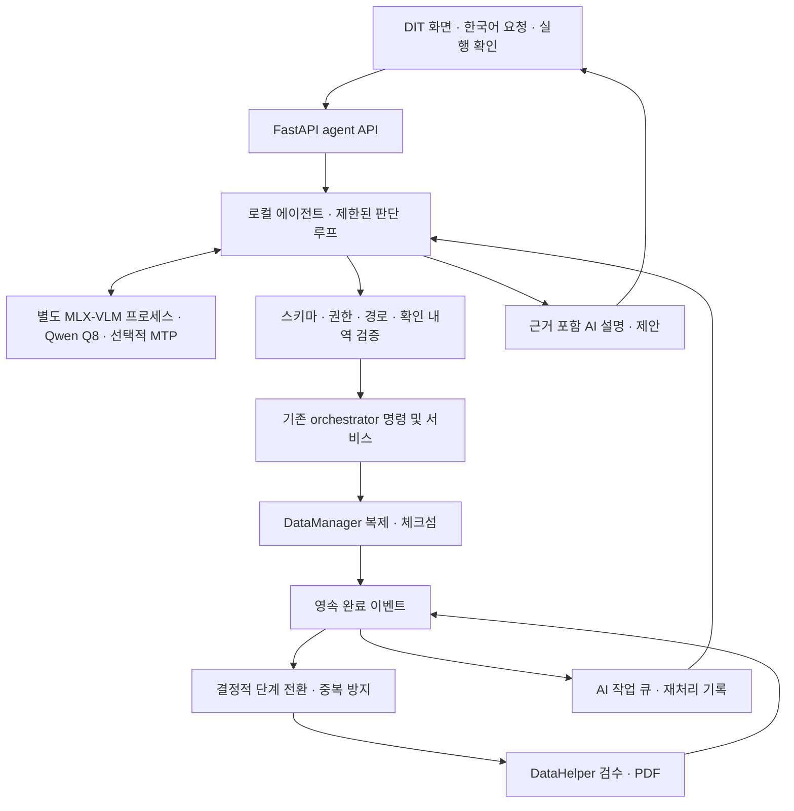

# Data Handler 로컬 AI 에이전트 설계

작성일: 2026-09-08. 상태: 조사 및 아키텍처 제안. 모델 설치·추론 벤치마크·앱 구현은 수행하지 않았다.

## 1. 선정 결과

**현재 M4 Max / GPU 40코어 / 통합 메모리 64GB에서는 Qwen3.8-27B MLX affine 8bit를 기본 모델로 선정한다. 추론은 별도 MLX-VLM 프로세스로 분리하고, 동일 원본 체크포인트의 MTP drafter는 A/B 검증 후 활성화한다.**

선정 기준은 한국어 작업 지시, 구조화된 도구 호출, 완료 기록 해석, 메모리 여유, 기존 Python 앱과의 연결 비용이다. 이는 하드웨어와 공개 지원 근거에 따른 설계 선정이며, 이 앱에서 다른 모델보다 정확하다는 실측 결론은 아니다. 품질이 비슷하면 더 빠른 Gemma 4 26B-A4B IT Q8 또는 Qwen3.6-35B-A3B Q8로 교체할 수 있게 한다.

확인한 기본 모델은 [mlx-community/Qwen3.8-27B-8bit](https://huggingface.co/mlx-community/Qwen3.8-27B-8bit)다. 조사 시 revision은 `815b83c0df8ffd1d1b5244cf75fd6ef14fca9ef9`, 배포 크기 표시는 약 29.5GB다. 모델 카드에는 MLX-VLM 변환 및 사용법이 있다. `Q8`은 여기서 MLX affine int8/group_size=64를 뜻하며 GGUF Q8_0, FP8, oQ8e와 동일 포맷이 아니다.

[Qwen 공식 모델 카드](https://huggingface.co/Qwen/Qwen3.8-27B)는 Qwen3.5 계열 구조를 바탕으로 한 Qwen3.8-27B를 확인해 준다. [별도 MTP Q8 가중치](https://huggingface.co/mlx-community/Qwen3.8-27B-MTP-8bit)도 배포돼 있다. MTP는 독립적으로 대화하는 두 번째 에이전트가 아니라 본 모델이 검증할 토큰을 제안하는 보조 가중치다.

## 2. 후보 비교

사용자가 명시하지 않은 35B/80B의 정확한 이름은 Swiftlet의 지원 목록에 따라 각각 Qwen3.6-35B-A3B, Qwen3-Next-80B-A3B로 해석했다. 다른 모델을 뜻한다면 해당 행의 평가를 다시 해야 한다.

| 후보 | 64GB Mac에서의 판단 | 채택 위치 |
|---|---|---|
| Qwen3.8-27B MLX Q8 | 약 29.5GB 배포본으로 메모리 상주 가능성이 높고, 본 모델과 MTP 배포 경로가 확인됨. 실제 총 사용량과 지연은 측정 필요 | 기본 선정 |
| Qwen3.6-35B-A3B MLX Q8 | MoE라 활성 연산량은 작지만 전체 가중치 메모리는 필요. 8bit 가중치만 대략 35GB 수준에 부가 메모리 추가. MLX 상주 방식도 비교해야 공정함 | 속도 대안 |
| 같은 35B Q8 + Swiftlet | 저메모리에 유리하나 저장장치 읽기 및 긴 프롬프트 처리 비용이 큼 | 메모리가 부족한 장비용 실험 |
| Qwen3-Next-80B-A3B Q4 + Swiftlet | 낮은 RAM으로 실행 가능하나 80B가 곧 업무 정확도 우위를 뜻하지 않음 | 기본 제외 |
| 80B Q8 | 가중치만 약 80GB이므로 64GB에 전체 상주 불가. Swiftlet의 확인된 80B 예시는 Q4이며 Q8 지원을 가정하지 않음 | 기본 제외 |
| Gemma 4 26B-A4B IT Q8 | MoE 효율과 함수 호출 지원이 매력적. 전체 가중치 기준 약 26GB에 양자화 메타데이터·캐시 등이 추가됨 | 가장 먼저 A/B할 대안 |
| Gemma 4 31B IT Q8 | 더 큰 dense 모델. 한국어·업무 판단에서 실제 이득이 지연과 메모리 비용을 상쇄하는지 확인 필요 | 품질 대안 |
| Gemma 4 E2B/E4B/12B | 낮은 자원 사용이 우선인 장비에서 검토. 현재 64GB 장비의 주 업무 모델로 먼저 고를 이유는 약함 | 저자원 후보 |

Gemma 4는 실제 공개 모델 계열이며 함수 호출을 지원한다. [Google 설명](https://deepmind.google/models/gemma/gemma-4/)과 [26B IT Q8](https://huggingface.co/mlx-community/gemma-4-26b-a4b-it-8bit), [31B IT Q8](https://huggingface.co/mlx-community/gemma-4-31b-it-8bit) 배포본을 확인했다. base 모델 대신 IT 모델을 사용한다. 서로 다른 공개 벤치마크 점수만으로 이 앱의 한국어 운영 정확도 순위를 확정하지 않는다.

## 3. Swiftlet을 기본 엔진으로 고르지 않은 이유

[Swiftlet README](https://github.com/leonickson1/Swiftlet)는 Qwen MoE 가중치를 SSD에서 선택적으로 읽는 Swift/Metal 런타임이다. 조사 시 프로젝트가 제시한 M5 측정치는 다음과 같다. 이 Mac의 측정치가 아니다.

| 모델/양자화 | 디스크 | Peak RAM | M5 decode |
|---|---:|---:|---:|
| 35B Q4 | 18GB | 2.6GB | 7–11 tok/s |
| 35B Q8 | 34GB | 7.6GB | 3.5–4 tok/s |
| 80B Q4 | 42GB | 4.3GB | 4.5–5 tok/s |

README에는 batched prefill이 로드맵에 있으며 긴 프롬프트가 느린 제약이 명시돼 있다. 많은 도구 스키마와 작업 기록을 넣는 에이전트에서는 첫 응답 지연에 직접 영향을 준다. 영상 복제와 저장장치 자원을 공유할 때 경합 가능성도 있다. 내부 SSD와 외장 복제 디스크가 분리되면 영향은 달라지므로 벤치마크로 확인해야 한다.

Swiftlet의 지원 범위는 해당 Qwen MoE 계열이다. Qwen3.8-27B dense 및 Gemma 4를 그대로 연결할 수 있다고 가정하지 않는다. 추후 별도 adapter로 연결할 수는 있으나 초기 포팅 과제로 삼지 않는다.

## 4. 런타임과 메모리 정책

초기 런타임은 **MLX-VLM**을 사용한다. 선택한 모델과 MTP 배포본이 이 경로를 안내하고, Python 앱에서 별도 프로세스로 분리하기 쉽다. [MLX-VLM 문서](https://github.com/Blaizzy/mlx-vlm)는 서버 및 speculative decoding의 `--draft-model`, `--draft-kind` 옵션을 제공한다. MTP 가중치 존재, CLI 작동, 서버의 도구 호출·취소·캐시 작동은 별개의 검증 항목이다.

`mlx-lm --draft-model`만 붙이면 Qwen MTP가 자동 지원된다고 가정하지 않는다. [해당 모델 타입 로딩 문제 보고](https://github.com/ml-explore/mlx-lm/issues/1462)가 있으며, 구현에서는 설치 버전과 실제 코드 경로를 고정해 확인한다. 관리 UI가 필요하면 [oMLX](https://github.com/jundot/omlx)를 대체 추론 서버로 검토한다. oMLX가 추론과 캐시를 맡더라도 도구 실행 권한은 Data Handler가 소유한다.

다음 수치는 **초기 운영 예산**이다. RSS 실측 또는 보장된 한계가 아니다. HF의 GB는 10진수, 아래 GiB는 2진수다.

| 항목 | 초기 예산 |
|---|---:|
| Q8 배포 가중치 | 약 27.5GiB에 해당; 실제 로딩 메모리는 별도 |
| 캐시·연산 버퍼·MTP 여유 | 약 4–10GiB |
| 추론 프로세스 상한 목표 | 40GiB |
| OS·앱·미디어 작업용 여유 | 나머지 약 24GiB |

- 컨텍스트는 총 8K 토큰부터 시작하고 검증 후 16K로 확대한다. 최대 광고 컨텍스트를 기본값으로 사용하지 않는다.
- 16개 full-attention 층, KV head 4개, head_dim 256, FP16 K/V라면 8K KV는 `16 × 2 × 4 × 256 × 8192 × 2 bytes = 0.5GiB`다. 선형 attention 상태·시각 입력·MTP 캐시·prefill 버퍼는 이 값에 포함되지 않는다. 구조 값은 [배포 config](https://huggingface.co/mlx-community/Qwen3.8-27B-8bit/blob/main/config.json)를 기준으로 했다.
- 모델 하나, 동시 생성 하나. 대기 작업은 큐로 직렬화한다. Qwen과 Gemma를 동시에 올리지 않는다.
- 일반 분류·도구 선택은 짧은 출력(예: 512토큰), 설명은 최대 1,024토큰부터 시작한다. reasoning은 지원 여부를 확인한 제한된 별도 프로필로 운용한다.
- MTP는 초기 OFF. 동일 checkpoint 계보와 tokenizer/template 호환을 확인한 Q8 drafter로만 A/B한다. 활성화 후에도 언제든 기본 decode로 복귀할 수 있어야 한다.
- 미디어 작업 중 모델 다운로드·모델 교체·큰 cold load를 예약하지 않는다. AI 요약 작업은 완료 이벤트 후 큐에 쌓고 자원 여유가 있을 때 실행한다.
- 앱 작업 상태와 OS memory pressure로 admission control을 수행한다. 복사 속도나 라이브 로그를 감시해 LLM을 호출하지 않는다.
- swap 증가·memory pressure 시 생성 취소→캐시 해제→모델 unload. AI가 멈춰도 복사와 체크섬 검증은 계속된다.
- 초기에는 디스크 기반 대규모 KV 캐시를 사용하지 않는다. 필요하면 내부 SSD에 제한된 캐시만 두고 촬영 원본·복제 볼륨을 캐시 위치로 쓰지 않는다.

## 5. 앱 연결 구조

현재 앱은 SwiftUI 추론 앱이 아니라 WebView/웹 UI + FastAPI + Python orchestrator 구조다. 기존 프로세스에 수십 GB 모델을 직접 넣지 않는다.



복제→검수→정형 리포트 생성은 기존 코드가 수행한다. AI는 한국어 요청을 구조화하고, 완료 결과·실패 원인을 설명하며, 실행할 수 있는 다음 조치를 제안한다. 첫 버전은 JSON·정형 메타데이터 중심으로 동작한다. 원본 영상 전체를 모델에 넣지 않는다. 썸네일 기반 시각 분석은 후속 기능이며 체크섬 판정과 분리한다.

에이전트의 추론 loop는 제안→검증→도구 결과→설명 순서로 최대 4회, 출력 스키마 재시도는 최대 1회로 제한한다. malformed JSON, 알 수 없는 도구, 제한 초과는 `needs_review`로 종료한다. 스키마 유효성이 사실의 정확성을 보장하지 않으므로 결과의 사실 필드도 원본 artifact와 대조한다.

## 6. 자동 수행 범위와 도구 계약

| 도구 | 입력/출력 요지 | 정책 |
|---|---|---|
| `get_project_context` | project_id → 프로젝트·선택 가능한 경로 ID | 읽기 |
| `get_run_evidence` | run_id → request/state/done 요약 및 evidence_id | 읽기, 완료 기록 중심 |
| `preview_import` | project_id, source_id, replica_ids, 촬영 메타데이터 → 최종 경로·plan_hash | 읽기/계획 생성 |
| `start_approved_import` | plan_id, 서버 발급 confirmation_id → run_id | 확인된 계획과 일치할 때만 |
| `propose_recovery` | run_id, evidence_ids → 실패 유형·제안 | 실행 없는 제안 |
| `save_agent_note` | run_id, 구조화 결과 → 새 AI 설명 artifact | 엔진 결과와 분리된 기록 |

현행 AGENTS.md는 실행 전 소스 경로, 복제 경로, 프로젝트 이름 확인을 요구한다. 기존 경로 확인 화면에서 받은 확인을 서버가 기록하고 재사용한다. 확인된 동일 계획에 질문을 반복하지 않는다. 볼륨 UUID, 해석된 실제 경로, 프로젝트, roll 예약, 요청 내용이 바뀌면 계획을 무효화한다. 다른 카드를 같은 이름의 볼륨으로 오인하지 않도록 volume 식별자와 source fingerprint도 포함한다. 프로젝트 전체에 대한 무제한 자동 실행 승인은 기본으로 추정하지 않는다.

LLM에는 범용 shell, 임의 파일 쓰기, `rm`, 포맷, 원본 삭제, 임의 Python 실행, 외부 메시지 전송 도구를 주지 않는다. 이는 데이터 복제 앱의 구체적인 권한 경계다. 도구 입력은 문자열 경로 대신 서버가 발급한 ID를 우선 사용한다. ID를 경로로 변환할 때 allowed roots, symlink escape, 원본/복제 중첩, 볼륨 연결 상태를 재검사한다. 파일명·리포트 본문 속 지시문은 데이터이며 승인 토큰을 만들거나 정책을 바꾸지 못한다.

AI 응답 스키마 예시:

```json
{
  "run_id": "run-example",
  "assessment": "needs_review",
  "summary_ko": "두 번째 복제본의 검증이 완료되지 않았습니다.",
  "evidence_ids": ["datamanager.done:replicas_complete"],
  "proposed_action": "inspect_replica",
  "arguments": {"replica_id": "replica-2"}
}
```

위 예시는 형식만 보여 준다. 서버가 두 번째 복제본이라는 근거까지 제공하지 않았다면 이 문장을 허용하지 않고, 어느 복제본인지 불명확하다고 표현한다. verified/completed 표시는 AI 문구가 아니라 엔진 완료 artifact의 필드로만 결정한다.

## 7. 기존 코드의 연결 지점과 보강 사항

| 현재 파일 | 확인한 동작 | 구현 시 계획 |
|---|---|---|
| `orchestrator/dit_app/server.py` | 기존 API 앱을 결합하고 카드 상태를 생성 | `/api/agent/*` 라우터·AI 설명을 추가, 검증 상태 계산은 유지 |
| `orchestrator/app_front/server.py` | 경로 검증, roll 예약, start_run 연결 | 실행 계획 확인을 재사용하는 공유 서비스 추출. 에이전트가 CLI만 불러 registry 예약을 우회하지 않게 함 |
| `orchestrator/datamanager_worker.py` | 완료 artifact 기록 후 workflow면 DataHelper 시작 | 결정적 자동 전환 유지, 전환 전 검증 조건 보강 |
| `orchestrator/stages.py` | 시작 artifact 존재 확인으로 중복 방지 | 모든 호출 경로가 공유하는 run별 프로세스 간 lock·원자적 claim 추가 |
| `orchestrator/watcher.py` | 완료 이벤트를 검색하고 Hermes 또는 직접 처리 | 로컬 모드에서는 결정적 처리와 AI 큐 적재를 분리. content hash 기반 소비 기록 추가 |
| `orchestrator/hermes_bridge.py` | Hermes에 고정 continue 명령을 실행하도록 요청 | provider=local에서 우회. Hermes 호환 경로는 선택 기능으로 보존 |
| `orchestrator/cli.py` | 시작·후속 단계·최종 리포트·전달 | 미디어 완료 처리와 외부 전달 분리, 로컬 후속 처리가 gateway에 의존하지 않게 함 |
| `orchestrator/paths.py` | 개발/패키지 상태 경로 | AI 저장 위치도 PIPELINE_ROOT를 사용 |

특히 현재 `validate_datahelper_input()`은 failed 여부와 replica roots를 검사하지만 `status == completed && replicas_complete == true`를 강제하지 않는다. UI의 verified 판정은 이보다 엄격하다. 자동 에이전트 도입 시 기본 자동 검수 진입도 엄격한 기준으로 맞추고, warn/부분 복제는 검토 대상으로 남기는 정책을 제안한다. 이는 기존 동작을 바꾸는 설계 결정이므로 회귀 검증이 필요하다.

현재 `started_path.exists()` 검사 후 파일 쓰기는 두 프로세스가 동시에 통과할 여지가 있다. watcher와 worker를 모두 같은 lock/claim 경로로 모은다. marker 생성 직후 프로세스 시작 전에 죽은 경우를 구별하기 위해 `claimed / spawned / completed / uncertain` 상태와 실행 identity를 기록한다. 만료 시간만 보고 중복 실행하지 않는다. PID 재사용도 고려해 복구하고, 실제 실행 여부를 입증하지 못하면 검토 대상으로 보낸다.

이번 작업에서는 위 코드를 변경하지 않았다. DataManager/DataHelper 소스 변경 없이 최상위 orchestrator에 구현하는 범위다.

## 8. 완료 이벤트·기억·장애 복구

기존 `request.json`, `state.json`, `events/*.done.json`을 업무 상태의 원본으로 유지한다. AI 메모는 별도 저장하며 엔진의 완료 artifact를 덮어쓰지 않는다.

```text
PIPELINE_ROOT/
  agent/queue.sqlite3              # unique(event_key, task_kind), lease, attempts
  agent/config.json                # 모델 revision, runtime, 자원 상한
  runs/<run_id>/
    request.json
    state.json
    events/*.done.json
    agent/decisions/<event_hash>.json
    agent/notes/<event_hash>.md
    agent/approvals/<plan_hash>.json
    agent/audit.jsonl
    delivery.<phase>.pending.json  # 기존 전달 실패 기록
```

완료 이벤트의 정규화된 내용 hash와 run_id/phase를 event_key로 사용한다. watcher는 지원하는 완료 phase를 명시적으로 분류하고, 기타 preflight 이벤트는 실패 설명 등 정의된 task에만 연결한다. 이벤트 인식과 durable enqueue가 끝나야 소비 위치를 전진시킨다. AI 작업 성공 표시는 검증된 결과를 원자적으로 저장한 뒤 기록한다. 동일 이벤트 재발견은 unique key로 합쳐지며, 같은 단계의 내용이 바뀐 이벤트는 새로운 근거로 처리한다.

전달은 at-least-once + 멱등 소비를 전제로 한다. JSON marker 하나로 exactly-once 실행을 보장한다고 주장하지 않는다. 에이전트/서버 재시작 시 pending 작업을 복원하고, 부작용 작업은 기존 실행 identity와 확인 내역을 대조한다. 추론 timeout은 1회 재시도 후 보류한다. 완료 사실과 정형 리포트는 계속 표시하고 AI 설명만 나중에 재개한다.

Hermes gateway가 불가능하면 기존 `delivery.<phase>.pending.json`과 로컬 artifact 경로를 유지한다. AI 추가가 외부 전달 재시도나 미디어 후속 단계를 중복 실행하는 계기가 되어서는 안 된다. 사용자가 요청하지 않은 메시지를 자동으로 외부에 전송하지 않는다.

## 9. 프로세스 배포

- FastAPI/미디어 실행 환경과 MLX용 Python 환경을 분리한다. inference process는 launchd 또는 앱 소유 supervisor 중 하나만 관리해 이중 기동을 방지한다.
- API는 명시적으로 `127.0.0.1`에 bind한다. 무작위 로컬 bearer token, request 크기/시간 제한을 적용한다. 모델 서버는 생성만 수행하고 앱의 도구 executor에 접근하지 않는다.
- 지원이 확인된 모델 ID 하나만 허용한다. 요청으로 임의 모델을 다운로드하거나 임의 URL/로컬 파일을 읽는 기능은 노출하지 않는다. 향후 이미지 입력도 앱이 검증한 로컬 bytes만 전달한다.
- 모델·tokenizer·chat template·runtime 버전과 revision을 lock manifest로 묶는다. main/latest 자동 업데이트는 작업 중 적용하지 않는다.
- 모델은 앱 번들 외부 Application Support의 모델 저장소에 둔다. 최초 다운로드 및 업데이트 후에는 로컬 경로만 사용하고 오프라인 동작을 검증한다. Apache/MIT 등 실제 포함 라이선스와 NOTICE를 패키지에 보존한다.
- UI 종료와 실제 worker 종료는 분리한다. 모델 종료가 복사 프로세스를 종료하지 않아야 한다. 추론 프로세스 crash 시 bounded backoff로 재기동하고 반복 실패는 AI만 비활성화한다.

## 10. 검증 및 도입 순서

1. **읽기 전용 POC:** Qwen Q8, MTP OFF. 완료 artifact fixture로 한국어 설명·근거 참조·JSON 호출만 검증한다.
2. **모델 비교:** 같은 100개 업무 케이스로 Qwen Q8, Gemma 26B IT Q8, Qwen35B Q8을 순차 실행한다. Gemma31B는 품질 부족이 확인될 때 추가한다. 모델을 바꿀 때 이전 프로세스 메모리가 해제됐는지 확인한다.
3. **MTP A/B:** 같은 Qwen target로 OFF/ON 비교. 짧은 도구 출력·긴 한국어 설명, 2K/8K/16K 입력, cold/warm prompt를 나눠 TTFT·전체 응답 시간·peak memory·draft acceptance를 측정한다. 같은 샘플링 설정에서 업무 결과와 tool arguments를 비교한다. 이득이 없는 경우 OFF를 유지한다.
4. **실행 계층:** 확인 토큰, 경로 ID, 이벤트 큐, lock/claim을 구현한다. 승인된 테스트 원본과 두 임시 복제 위치로만 end-to-end 테스트한다.
5. **미디어 동시 부하:** 격리된 테스트 복제/체크섬/PDF 생성에서 AI OFF/ON을 비교한다. 운영 중인 작업을 라이브 감시하지 않는다. 테스트 종료 artifact와 수집한 측정 결과로 판정한다.
6. **패키징:** 모델 없는 앱 번들, 별도 추론 환경, 오프라인·재시작·복구 동작을 확인한다.

업무 fixture는 정상 완료, 체크섬 불일치, 부분 복제, 볼륨 분리, 이름이 같은 다른 볼륨, PDF만 실패, 데이터 부족, 긴/한글 경로, 중복 완료 이벤트, crash 후 재시작, 파일명 속 프롬프트 주입, 미확인 실행 요청을 포함한다.

초기 통과 목표(실측 결과 아님):

| 항목 | 목표 |
|---|---|
| 근거 없는 검증 완료·확인 없는 실행 | 테스트 전체에서 0건 |
| 첫 응답의 스키마/도구 인자 유효성 | 99% 이상 |
| 정답 기준 업무 판단 및 근거 연결 | 95% 이상, 실패 케이스별 수동 검토 |
| 2K 입력/128토큰 출력 warm 응답 | p95 15초 이내를 초기 UX 목표로 측정 |
| MTP 채택 | 품질 회귀 없이 대표 workload의 p95 전체 응답 시간 20% 이상 개선 |
| 자원 | 목표 40GiB 이내, 지속적인 swap 증가 없음 |
| 미디어 영향 | 같은 테스트 workload 완료 시간 악화 5% 이내; 초과 시 AI 실행을 더 늦춤 |
| 재시작/중복 이벤트 | 중복 미디어 실행 0건, AI pending 작업 복원 |

수치는 예비 출시 gate이며 지연 목표를 만족하지 못하면 먼저 컨텍스트·출력 예산을 줄이고, 같은 품질 기준을 통과하는 MoE 후보로 교체한다. 현재 장비의 tok/s 또는 한국어 정확도는 아직 측정되지 않았다.

구현 시 새 모듈은 `orchestrator/agent/{api,controller,schemas,tools,policy,evidence,queue,inference,supervisor}.py`로 책임을 나누되, 실행 권한과 영속 상태는 orchestrator 안에 둔다. 첫 버전에는 벡터 DB, 파인튜닝, 다중 에이전트가 필요하지 않다. 완료 artifact의 구조화 조회와 제한된 도구 루프면 충분하다.

관련 구현 후 필수 회귀 검증은 `python -m pytest orchestrator/tests`다. 이번 설계 작업에서는 문서만 추가했으며 모델 추론 및 앱 회귀 테스트를 수행한 것으로 간주하지 않는다.

## 11. 원격 메신저와 오프라인 자율 실행

사용자 확정 요구: Telegram 등 메신저는 인터넷이 있을 때 요청 수신과 결과 전달에만 사용한다. 접수와 필요한 실행 확인이 끝난 작업은 Mac의 로컬 AI와 orchestrator가 인터넷 없이 복제→체크섬 검증→검수→리포트 생성까지 진행한다. 단계마다 사용자에게 재승인받지 않는다. 이 절은 기능 설계이며 메신저 연동 구현·계정 연결은 아직 수행하지 않았다.

메신저 adapter는 공통 agent API에 요청을 전달하는 입출력 계층이다. 추론·도구 실행·업무 상태는 모두 Mac에 둔다. Telegram 외의 메신저도 동일한 inbox/outbox 계약을 구현하면 연결할 수 있게 한다. 메시지 플랫폼별 API·파일 전송 한계·인증 방식은 실제 adapter 구현 시 공식 문서로 확인한다.

동작 순서:

1. 온라인일 때 허용된 사용자/대화방에서 요청을 수신하고, 플랫폼 메시지 ID를 unique key로 로컬 inbox에 영속 저장한다. 저장된 요청에만 접수 완료를 응답한다.
2. 에이전트가 프로젝트·소스·복제 위치를 해석한다. 요청 자체가 정확한 세 항목과 실행 의사를 명시하면 이를 확인 내역으로 기록할 수 있다. 모호한 항목만 실행 계획으로 되묻는다. 인터넷 연결만으로 미확인 계획을 승인된 것으로 취급하지 않는다.
3. 확인된 계획을 로컬 작업 큐에 넣고 기존 경로 검증·roll 예약·멱등 실행 서비스를 통해 시작한다. 이후 네트워크 연결 여부와 무관하게 로컬 단계 전환을 계속한다.
4. 모든 단계의 완료 artifact를 기반으로 결과를 확정하고 정형 리포트와 AI 요약을 저장한다. 일부 실패는 성공으로 표현하지 않으며, 복제 검증 결과와 PDF 생성 결과를 구분한다.
5. 요약과 리포트 첨부 경로/hash를 로컬 outbox에 저장한다. 온라인일 때 보내고 오프라인이면 보류한다. 전송 실패가 미디어 작업 재실행을 유발하지 않는다.
6. 연결 복구 후 보류된 보고를 재전송한다. 이미 성공 확인된 첨부는 다시 보내지 않는다. 전송 후 응답을 잃어버린 경우에는 중복 가능성을 기록하고, 미디어 실행은 절대 반복하지 않는다.

로컬 영속 기록은 `PIPELINE_ROOT/agent/queue.sqlite3`의 inbox/outbox 테이블과 run별 보고 artifact를 사용한다. inbox는 `(provider, message_id)`로 중복 수신을 제거하고, outbox는 `(provider, recipient_id, run_id, report_revision, attachment_id)`로 추적한다. 연결 장애는 전달 상태로만 기록한다. 기존 Hermes 전달의 pending 파일은 기존 경로에 유지하고, 같은 보고가 Hermes와 Telegram 양쪽에서 의도치 않게 발송되지 않도록 목적지별 정책을 둔다.

자율 처리 범위는 확인된 복제 계획과 그 후속 검수·보고다. 실행 중 디스크가 분리되거나 경로·볼륨 identity가 달라지면 안전하게 보류하고 로컬에 조치 요청을 남긴다. 다른 디스크로 임의 변경하지 않는다. 모델과 tokenizer 등 추론 자산은 사전에 로컬에 준비한다. Mac이 잠자기·종료 상태이면 실행이 진행되지 않으므로, 실행 수명에 맞춘 절전 방지와 재시작 복구를 구현한다.

추가 인수 테스트는 요청 중복 수신, 접수 직후 네트워크 단절, 작업 중 장시간 오프라인, 오프라인 상태에서 최종 보고 생성, 재연결 후 PDF 전달, 전송 성공 응답 유실, 승인 전 단절, 허용되지 않은 발신자, Mac 재시작을 포함한다. 합격 기준은 확인된 작업의 오프라인 완주, 중복 복제 0건, 미확인 실행 0건, 전달 복구 가능성이다.
